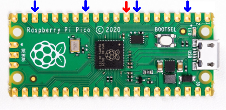
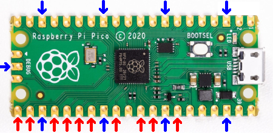

<h1 align="center">PiNinja 1.0</h1>

<div align="center">
  <strong>Turn your Raspberry Pi Pico into a cheap hacking device</strong>
</div>
<br />
<div align="center">
  
  
  <a href="https://github.com/dbisu/pico-ducky/graphs/contributors"></a>
  
  
</div>
<br />


## Quick Start Guide
Install and have your PiNinja working in less than 5 minutes.

1. Download the latest release from the [Releases](LINK HERE) page.

2. Plug the device into a USB port while holding the boot button. It will show up as a removable media device named RPI-RP2.

3. Install CircutlPython on the Pico

4. Copy the adafruit-circuitpython-raspberry_pi_pico-en_US-8.0.0.uf2 file to the root of the Pico (RPI-RP2). The device will reboot and after a second or so, it will reconnect as CIRCUITPY.

5. Copy the lib folder to the root of the CIRCUITPY

6. Copy _code.py_, and _boot.py_ files to the root of the CIRCUITPY

7. Follow the instructions in README.md to enter safe mode

8. Write your payload in _payload.py_ (You can have up to 6 payload files, from _payload.py_ to _payload_5.py_)

9. Unplug the device from the USB port and remove the code jumper.

Enjoy your PiNinja.

## Safe mode

To edit the payload, enter safe mode by connecting the pin 9 (`GP6`) to any ground pin (`GND`), this will stop the PiNinja from running the payload on your computer.
The easiest way to do so is by using a jumper wire between the pins seen below.



## USB enable/disable mode

If you need the PiNinja to not show up as a storage device, follow these instructions:
- Connect a jumper wire between pin 21, 22, 24, 25, 26, 27, 29, 31, 32, or 34 (`GP16`, `GP17`, `GP18`, `GP19`, `GP20`, `GP21`, `GP22`, `GP26_A0`, `GP27_A1`, `GP28_A2`) and any ground pin (`GND`).  
This will prevent the PiNinja from showing up as a USB drive when plugged into the computer.  
- Remove the jumper and reconnect to your PC to reprogram.  

The default mode is USB mass storage disabled.   




-----

# Full Install Instructions

Install and have your USB Rubber Ducky working in less than 5 minutes.

1. Clone the repo or download the code to get a local copy of the files.

2. Download [CircuitPython for the Raspberry Pi Pico](https://circuitpython.org/board/raspberry_pi_pico/).

3. Plug the device into a USB port while holding the boot button. It will show up as a removable media device named `RPI-RP2`.

4. Copy the downloaded _.uf2_ file to the root of the Pico (`RPI-RP2`). The device will reboot and after a second or so, it will reconnect as `CIRCUITPY`.
   
6. Navigate to `lib` in the source code folder and copy _adafruit_hid_ to the lib folder on your Raspberry Pi Pico.

7. Copy _adafruit_debouncer.mpy_ and _adafruit_ticks.mpy_ to the `lib` folder on your Raspberry Pi Pico.

8. Copy _asyncio_ to the `lib` folder on your Pico.

10. Copy _boot.py_ from the source code to the root of your Pico.

11. Copy _code.py_ to the root folder of the Pico.

13. Use the _blank_payload.py_

14. Be careful, if your device isn't in safe mode, the device will reboot and after half a second, the script will run.

15. **Please note:** by default Pico will not show as a USB drive

## Multiple payloads

Multiple payloads can be stored on the Pico.  
To select a payload, ground one of these pins:
- GP1 - _payload_1.py_
- GP2 - _payload_2.py_
- GP3 - _payload_3.py_
- GP4 - _payload_4.py_
- GP5 - _payload_5.py_

## Changing Keyboard Layouts

Download the `py` zip, named `circuitpython-keyboard-layouts-py-XXXXXXXX.zip`

**NOTE: You can use the mpy version targetting the version of Circuitpython that is on the device, but on Raspberry Pi Pico you don't need it - they only reduce file size and memory use on load, which the pico has plenty of.**

#### If your language/layout is not in the bundle

Try the online generator, it should get you a zip file with the bundles for your language

https://www.neradoc.me/layouts/

#### Now you have a zip file

#### Find your language/layout in the lib directory

For a language `LANG`, copy the following files from the zip's `lib` folder to the `lib` directory of the board.  
**DO NOT** modify the adafruit_hid directory. Your files go directly in `lib`.  
**DO NOT** change the names or extensions of the files. Just pick the right ones.  
Replace `LANG` with the letters for your language of choice.

- `keyboard_layout_win_LANG.py`
- `keycode_win_LANG.py`

Don't forget to get [the adafruit_hid library](https://github.com/adafruit/Adafruit_CircuitPython_HID/releases/latest).

This is what it should look like **if your language is French for example**.


#### Modify the payload code to use your language file:

In your ```main()``` function replace these lines

```py
from adafruit_hid.keycode import Keycode as key
from adafruit_hid.keyboard_layout_us import KeyboardLayoutUS as Layout
```

With These Lines:

**Replace `LANG` with the letters for your language of choice. The name must match the file (without the py or mpy extension).**
```py
from keycode_win_LANG import Keycode as key
from keyboard_layout_win_LANG import KeyboardLayoutUS as Layout
```

##### Example:  Set to German Keyboard (WIN_DE)

```py
from keycode_win_de import Keycode as key
from keyboard_layout_win_de import KeyboardLayoutUS as Layout
```

Copy the files keyboard_layout_win_de.mpy and keycode_win_de.mpy to the /lib folder on the Pico board
```
adafruit_hid/
keyboard_layout_win_de.mpy
keycode_win_de.mpy
```


## Useful links and resources

### How to recover your Pico if it becomes corrupted or doesn't boot.

[Reset Instructions](RESET.md)

### Docs

[CircuitPython](https://circuitpython.readthedocs.io/en/6.3.x/README.html)

[CircuitPython HID](https://learn.adafruit.com/circuitpython-essentials/circuitpython-hid-keyboard-and-mouse)

[CircuitPython HID Keycodes](https://docs.circuitpython.org/projects/hid/en/latest/_modules/adafruit_hid/keycode.html)

### Other Useful Links

[Raspberry Pi Pico GPIO Pinout Reference Sheet](https://pico.pinout.xyz/)

# Share Me!

[](https://ctt.ac/EUe93)

## Why use this over other tools?

Good question. The only other tool that comes to mind is [pico-ducky by dbisu](https://github.com/dbisu/pico-ducky/tree/main?tab=readme-ov-file). This is a great tool, and I have used it for a while, but there were some flaws that I noticed.

1. There are open pins on the board, but you cant use them to add external components like buttons or switches.
2. It uses DuckyScript 1.0, which doesnt allow for things like variables, loops, if statements, etc.

Now dont get me wrong, this is a great tool, and it probably took a good amount of time to code, but I really wanted to fix those flaws. So I made it run python instead of duckyscript. You may ask, "Why wouldn't I just use circutpython, when thats all it runs." While that is true, regular circutpython cannot save multipple scripts, and choose one to run at start.


